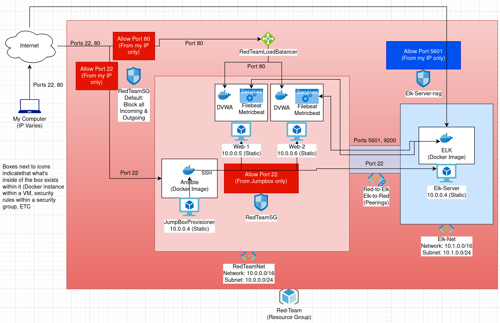
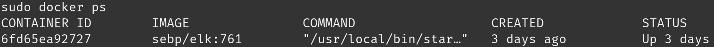
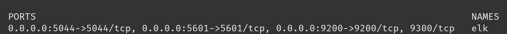

## Automated ELK Stack Deployment

The files in this repository were used to configure the network depicted below.



These files have been tested and used to generate a live ELK deployment on Azure. They can be used to either recreate the entire deployment pictured above. Alternatively, select portions of the playbook file may be used to install only certain pieces of it, such as Filebeat.

```YAML
---
 - name: Installing and Launch Filebeat
   hosts: webservers
   become: yes
   tasks:
     #Use a command module
    - name: Download filebeat.deb file
      command: curl -L -O https://artifacts.elastic.co/downloads/beats/filebeat/filebeat-7.4.0-amd64.deb

    - name: Install filebeat.deb file
      command: dpkg -i filebeat-7.4.0-amd64.deb

    - name: Drop in filebeat.yml
      copy:
        src: /etc/ansible/filebeat-config.yml
        dest: /etc/filebeat/filebeat.yml

    - name: Enable and Configure System Module
      command: filebeat modules enable system

    - name: Setup filebeat
      command: service filebeat start

    - name: Enable service filebeat on boot
      systemd:
        name: filebeat
        enabled: yes
```

This document contains the following details:
- Description of the Topologu
- Access Policies
- ELK Configuration
  - Beats in Use
  - Machines Being Monitored
- How to Use the Ansible Build

### Description of the Topology

The main purpose of this network is to expose a load-balanced and monitored instance of DVWA, the D*mn Vulnerable Web Application.

Load balancing ensures that the application will be highly available, in addition to restricting access to the network.
	Load balancers protect against denial of service attacks by routing traffic to 2 or more redundant servers. A jump box provides an additional layer of security as it provides a single point of through which you can access other important machines indirectly.

Integrating an ELK server allows users to easily monitor the vulnerable VMs for changes to the log files and system resources.
- Filebeat watches for changes in log files
- Metricbeat monitors resource usage

The configuration details of each machine may be found below.

| Name       | Function  | IP Address | Operating System |
|------------|-----------|------------|------------------|
| Jump Box   | Gateway   | 10.0.0.4   | Linux            |
| Web-1      | Webserver | 10.0.0.5   | Linux            |
| Web-2      | Webserver | 10.0.0.6   | Linux            |
| Elk-Server | Monitor   | 10.1.0.4   | Linux            |

### Access Policies

The machines on the internal network are not exposed to the public Internet. 

Only the jumpbox machine can accept connections from the Internet. Access to this machine is only allowed from the following IP addresses:
- Personal IP of admin, redacted, a single IP referred to subsequently as [Admin IP]

Machines within the network can only be accessed by jumpbox.
- Only the Jump box can access the elk server from 10.0.0.4

A summary of the access policies in place can be found in the table below.

| Name       | Publicly Accessible | Allowed IP Addresses |
|------------|---------------------|----------------------|
| Jump Box   | Yes                 | [Admin IP]           |
| Web-1      | No                  | 10.0.0.4             |
| Web-2      | No                  | 10.0.0.4             |
| Elk-Server | Yes                 | 10.0.0.4             |

### Elk Configuration

Ansible was used to automate configuration of the ELK machine. No configuration was performed manually, which is advantageous because the configuration can then be replicated easily on another machine. 

The playbook implements the following tasks:
- Set the elk-server VM to use more memory
- Install docker and pip (python packager) and the docker python module
- Download and launch the docker elk container, allowing access to it on ports 5601, 9200, and 5044
- Enable docker daemon at start

The following screenshot displays the result of running `docker ps` after successfully configuring the ELK instance.




### Target Machines & Beats
This ELK server is configured to monitor the following machines:
- 10.0.0.5 (Web-1), 10.0.0.6 (Web-2)

We have installed the following Beats on these machines:
- Filebeat, Metricbeat

These Beats allow us to collect the following information from each machine:
- Filebeat allows us to view logfiels as they are updated from each machine. Metricbeat allows us to monitor system resources for each machine

### Using the Playbook
In order to use the playbook, you will need to have an Ansible control node already configured. Assuming you have such a control node provisioned: 

SSH into the control node and follow the steps below:
- Copy the filebeat-playbook.yml file to /etc/ansible.
- Update the filebeat-config.yml file to include ips
- Run the playbook, and navigate to 104.209.33.31:5601/app/kibana to check that the installation worked as expected.
- To add or remove hosts as targets for ansible, we need to edit the hosts file, adding machines to specific groups (in our case, [webservers] and [elk]. We  then need to specify which group of machines the playbook is targeting in the beginning of your playbook.
